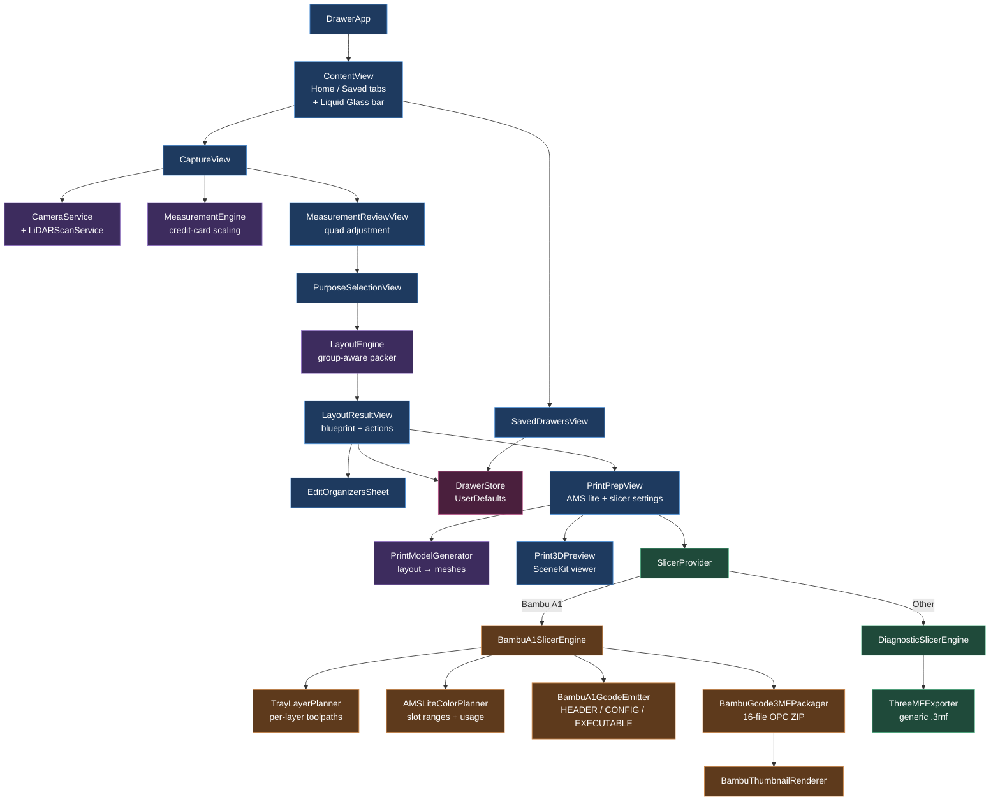
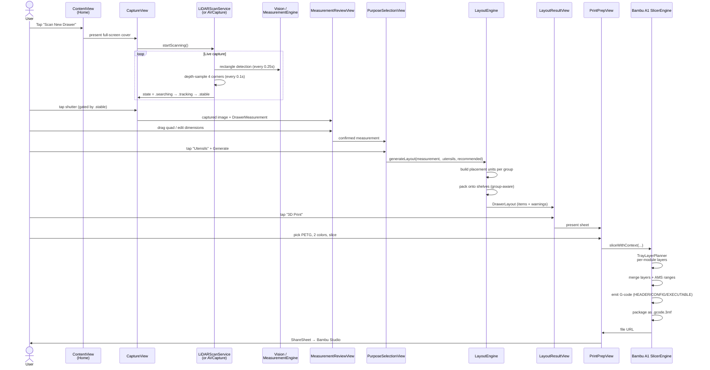
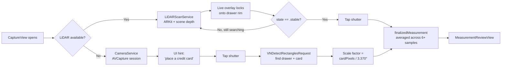
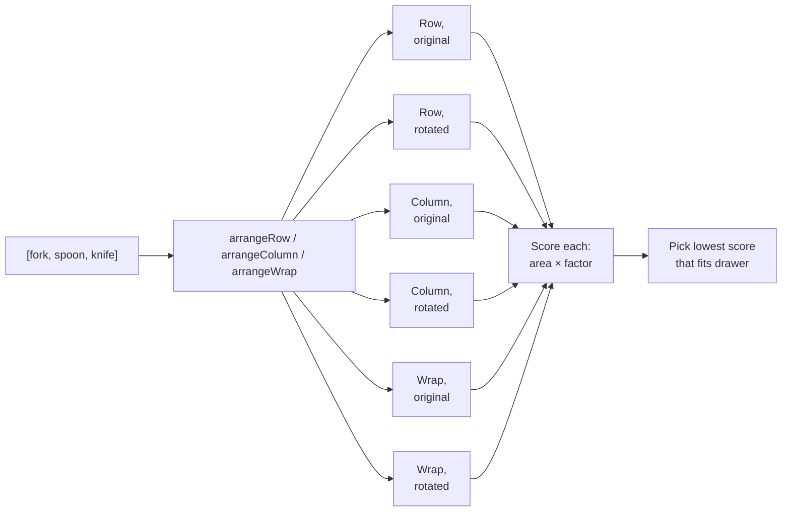
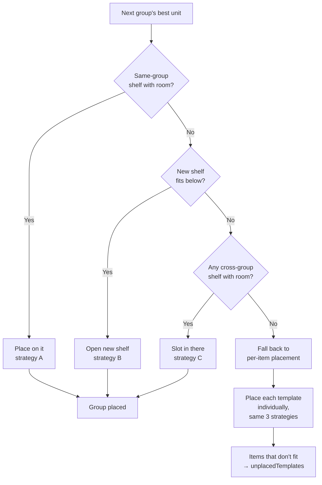
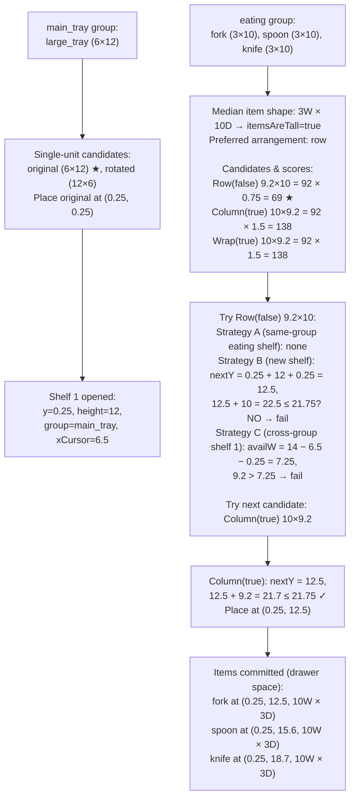
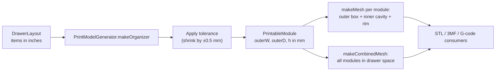
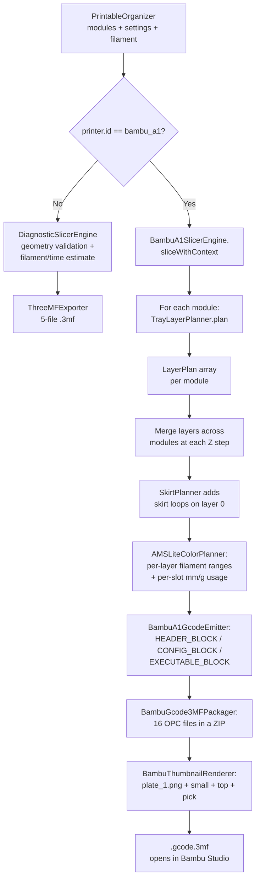
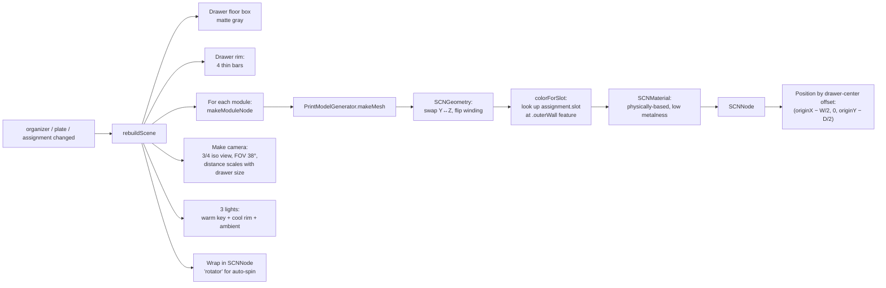
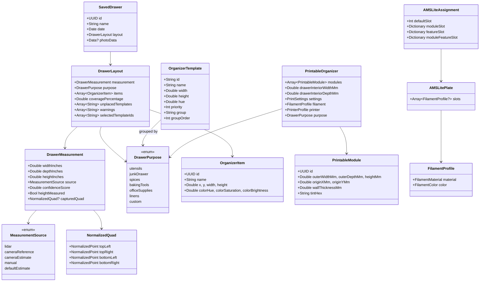

<div align="center">

# Drawer

### Scan a kitchen drawer. Get a custom 3D-printable organizer. Slice it natively for a Bambu Lab A1.

<br>


<br>

*An iOS app that turns a photo of an empty kitchen drawer into a printer-ready `.gcode.3mf` file with custom-fitted, color-coded organizer modules — all on-device.*

</div>

---

## Table of Contents

1. [What is Drawer?](#1-what-is-drawer)
2. [Demo & Screenshots](#2-demo--screenshots)
3. [Features at a Glance](#3-features-at-a-glance)
4. [System Architecture](#4-system-architecture)
5. [The User Journey](#5-the-user-journey)
6. [Codebase Tour](#6-codebase-tour)
7. [Subsystem Deep-Dives](#7-subsystem-deep-dives)
   - [7.1 The Measurement Pipeline](#71-the-measurement-pipeline)
   - [7.2 The Layout Engine](#72-the-layout-engine-the-heart-of-the-app)
   - [7.3 3D Mesh Generation](#73-3d-mesh-generation)
   - [7.4 The Bambu A1 Slicer](#74-the-bambu-a1-slicer)
   - [7.5 The 3D Preview](#75-the-3d-preview)
   - [7.6 Liquid Glass UI](#76-liquid-glass-ui)
8. [Data Model](#8-data-model)
9. [Persistence](#9-persistence)
10. [Glossary for Non-Coders](#10-glossary-for-non-coders)
11. [Build & Run](#11-build--run)
12. [License](#12-license)

---

## 1. What is Drawer?

### The Problem

Kitchen drawers are chaotic. Cutlery slides, spices roll, batteries mingle with rubber bands. Off-the-shelf organizers are sized for *some* drawer — never *yours*. Custom inserts cost a fortune; designing your own takes CAD skills most people don't have.

### The Solution

**Drawer** turns your iPhone into an end-to-end drawer-organization studio:

1. **Scan** an empty drawer with your phone's camera (LiDAR if your device has it; otherwise a credit-card reference for scale).
2. **Confirm** the auto-detected dimensions on a live overlay.
3. **Pick a category** — Utensils, Spices, Office Supplies, etc.
4. **The layout engine** generates a custom layout where related items end up *physically adjacent* (forks/spoons/knives in a tight row, spice rows stacked, pen-tray + sticky notes + index cards as a writing zone).
5. **Preview** the result in an interactive 3D viewer — rotate, zoom, see the exact AMS lite color assignment.
6. **Export** a printer-ready `.gcode.3mf` for the **Bambu Lab A1**, generated entirely on-device — or a generic `.3mf` for any other slicer.

Everything happens on your phone. No cloud. No subscription.

### Why This Is Hard (And Interesting)

The core technical challenges:

- **Accurate measurement from a photo.** Mixing ARKit LiDAR depth, Vision rectangle detection, and a credit-card scale reference fallback.
- **Context-aware layout.** Bin-packing is NP-hard and naive solvers will scatter related items. Drawer treats each semantic group as a *cohesive block* and chooses the arrangement (row / column / wrapped grid) that matches the items' natural shape.
- **A real on-device slicer for Bambu A1.** Not a third-party plugin — actual G-code generation, AMS lite tool-change planning, and the 16-file `.gcode.3mf` package format Bambu Studio expects.
- **A 3D preview that reflects exactly what will print.** SceneKit, with each module tinted by its assigned AMS lite slot color.

---

## 2. Demo & Screenshots

> *Add captured GIFs / screenshots here when ready. Suggested clips:*
> - Home screen with the Liquid Glass tab bar in motion
> - LiDAR scan locking onto the drawer rim with the live quad overlay
> - The blueprint view animating items in after layout generation
> - The 3D preview spinning, showing per-tray colors
> - A `.gcode.3mf` opening in Bambu Studio with the slice intact

---

## 3. Features at a Glance

| Area | What It Does |
|---|---|
| **Measurement** | LiDAR depth scanning with stability-locked capture; falls back to a credit-card reference scale when LiDAR is unavailable; manual override always available. |
| **Categories** | 7 built-in purposes (Utensils, Junk Drawer, Spices, Baking Tools, Office Supplies, Linens, Custom) with curated organizer catalogs per category. |
| **Smart Layout** | Group-aware shelf packer that places related items as cohesive blocks. Cutlery forms tight rows, spices stack, writing-zone items form a 2-row grid. |
| **Edit Organizers** | Add or remove individual organizers post-generation; the engine lays them out with the same context-aware logic. |
| **3D Preview** | Interactive SceneKit viewer with auto-rotate, drag-to-rotate, pinch-to-zoom, color-coded per AMS lite slot. |
| **Slicing** | Native Bambu Lab A1 G-code generation: per-layer toolpaths, AMS lite color ranges, real `.gcode.3mf` Bambu Studio recognizes. Other printers fall back to a clean `.3mf` for external slicers. |
| **AMS Lite** | 4-slot plate, 4 coloring policies (mono, per-module, per-feature, custom), automatic per-layer filament-list computation. |
| **Persistence** | Saved drawers stored in `UserDefaults` (small enough that a real database is overkill). Photo thumbnails included. |
| **Liquid Glass UI** | Real iOS 26 `.glassEffect()` material on the bottom tab bar and 3D preview controls — not a custom approximation. |
| **Animations** | Symbol effects, phase animators, matched geometry, sensory feedback, staggered entry — every interaction has a small physics-based response. |

---

## 4. System Architecture

The app is layered: SwiftUI views at the top, stateless engines and services below them, and a single persistent store at the bottom.



### What Each Layer Does

- **Views** *(blue)* — SwiftUI screens. They own UI state but delegate all logic to engines.
- **Engines** *(purple)* — pure functions / classes that take inputs and return outputs. No UI dependencies.
- **Slicers** *(green)* — pluggable through the `SlicerEngine` protocol.
- **Bambu pipeline** *(orange)* — specialized modules that together produce a real `.gcode.3mf`.
- **Persistence** *(magenta)* — `DrawerStore`, an `ObservableObject` that loads/saves to `UserDefaults`.

---

## 5. The User Journey

This is what happens when a user goes from a messy drawer to a printable file.



Each step gates the next: you can't pick a purpose before confirming a measurement, and you can't slice before a layout exists.

---

## 6. Codebase Tour

The project is ~10,800 lines of Swift across 27 files. Every file has one job.

```text
Drawer/
├── DrawerApp.swift              ← App entry point (17 lines, just hosts ContentView)
├── ContentView.swift            ← Root UI: home tab, page TabView, Liquid Glass bar
├── DesignSystem.swift           ← Shared tokens: GlassCard, PressableStyle, accent colors
│
├── CaptureView.swift            ← Camera + scan UI, overlay, capture flow
├── CameraService.swift          ← AVFoundation session + ARKit LiDAR scan service
├── MeasurementEngine.swift      ← Vision rectangle detection + credit-card scaling
├── MeasurementReviewView.swift  ← Adjust the auto-detected quad and dimensions
│
├── DrawerModels.swift           ← Core data types: measurement, layout, saved drawer
│
├── PurposeSelectionView.swift   ← Pick a category (utensils, spices, …)
├── LayoutEngine.swift           ← Catalogs + group-aware packing algorithm
├── LayoutResultView.swift       ← Blueprint + share/save/print actions
├── SavedDrawersView.swift       ← Persisted-drawers list
├── EditOrganizersSheet.swift    ← Add/remove individual organizers
│
├── PrintModels.swift            ← Print-pipeline types: filament, printer, settings, modules
├── PrintModelGenerator.swift    ← Layout → printable modules + triangle meshes
├── Print3DPreview.swift         ← SceneKit viewer (drag-rotate, auto-spin, AMS colors)
├── PrintPrepView.swift          ← Print prep UI: AMS slots, materials, slice & export
│
├── SlicerEngine.swift           ← Slicer protocol + DiagnosticSlicerEngine fallback
├── ThreeMFExporter.swift        ← Generic .3mf for non-Bambu printers (incl. ZipWriter)
│
├── BambuA1SlicerEngine.swift    ← Native A1 slicer: orchestrates layers → gcode → package
├── TrayLayerPlanner.swift       ← Per-layer rectangular toolpaths + zigzag bottom infill
├── AMSLiteColorPlanner.swift    ← Slot assignment + per-layer filament-list ranges
├── BambuA1GcodeEmitter.swift    ← Renders HEADER_BLOCK / CONFIG_BLOCK / EXECUTABLE_BLOCK
├── BambuGcode3MFPackager.swift  ← Assembles the 16-file Bambu OPC ZIP
├── BambuPackageMetadata.swift   ← XML/JSON payloads (3dmodel.model, plate_1.json, etc.)
├── BambuReferenceAssets.swift   ← Bambu A1 identifiers + filament catalog (PLA/PETG/…)
└── BambuThumbnailRenderer.swift ← PNG thumbnails Bambu Studio shows in the file picker
```

---

## 7. Subsystem Deep-Dives

### 7.1 The Measurement Pipeline

#### What it does, in plain English

Drawer needs to know how big your drawer is, in inches. There are two ways:

1. **LiDAR** — modern iPhones (Pro models since the 12 Pro) have a real depth sensor. Drawer projects four "rays" through the corners of the on-screen rectangle, reads the depth at each, converts those depths to 3D world points, and measures the distances between them.
2. **Camera + credit card** — devices without LiDAR can't measure depth, so the user places a credit card flat in the drawer. The card is exactly **3.370″ × 2.125″** (ISO/IEC 7810 ID-1, the international standard). Drawer detects both rectangles, divides the card's pixel size by its real size to get a "pixels per inch" ratio, and applies that to the drawer rectangle.

Both paths can be overridden manually on the review screen.

#### Path selection



#### LiDAR state machine

`LiDARScanService.ScanState`:

```text
.initializing  →  .searching  →  .tracking  →  .stable  ─┐
                                                          ├→ user can capture
                                       .failed(reason)  ──┘
```

The shutter is **only** enabled when `scanState == .stable`. To reach `.stable`:
- ARKit tracking quality > 0.6
- Scene-depth confidence > 0.65 at all four corners
- ≥ 6 measurements collected, with width/depth standard deviation small enough
- Detected rectangle quad is geometrically valid (positive area, all four corners visible)

The history buffer holds 12 samples; once stable, the final measurement is the **average of the most recent stable samples**. This kills jitter from hand shake.

#### Frameworks involved

| Framework | What it's used for |
|---|---|
| **ARKit** | `ARWorldTrackingConfiguration` with `.sceneDepth` semantics; `ARFrame.smoothedSceneDepth` for the depth map; `ARPlaneAnchor` for the floor plane (used by the height estimate) |
| **Vision** | `VNDetectRectanglesRequest` finds the drawer rim quad in the camera frame, throttled to 4 Hz; same request type with different parameters detects the credit card on the non-LiDAR path |
| **AVFoundation** | Photo capture + camera permission on the non-LiDAR path |
| **simd** | Camera-intrinsics matrix math for unprojecting 2D corners into 3D world space |

#### The credit-card math

```
realCardWidthInches  = 3.370   ← ISO/IEC 7810 ID-1
realCardHeightInches = 2.125

scaleLong  = refPixelLong  / 3.370
scaleShort = refPixelShort / 2.125
scale      = (scaleLong + scaleShort) / 2     ← average of both axes

drawerWidthInches = drawerPixelWidth / scale
drawerDepthInches = drawerPixelHeight / scale
```

The `MeasurementEngine` enforces sanity bounds (3″–60″ width, 3″–40″ depth) and falls back to a default 15″ × 20″ × 4″ measurement on failure, surfacing an error banner so the user knows to type values in.

---

### 7.2 The Layout Engine (the heart of the app)

This is where the app earns its keep. Every other subsystem feeds in or out of `LayoutEngine`.

#### What it does, in plain English

You have a drawer. You have a list of organizer modules to fit in it. The layout engine has to figure out **where to put each one** so that:

1. They actually fit (basic geometry).
2. **Items that semantically belong together end up touching, in a layout that looks like how a real organizer would arrange them.** Forks, spoons, and knives become a tight row of slots — *not* fork in one corner, knives in another.

A naive bin-packer optimizes only for area. Drawer optimizes for *organization sense*.

#### Step 1: The catalog

Each `DrawerPurpose` has a hand-curated list of `OrganizerTemplate`s. Every template has six fields:

| Field | Purpose |
|---|---|
| `id` | Stable identifier (e.g. `utensils.fork`) |
| `name` | Human label (e.g. "Fork Section") |
| `width`, `height` | Physical size in inches (height = depth in the drawer) |
| `hue` | Visual tint on the blueprint (cosmetic) |
| `priority` | Used to mark "recommended" defaults (`priority >= 5`) |
| **`group`** | **Semantic category — items in the same group are placed adjacent** |
| **`groupOrder`** | **Reading order within the group (1 = leftmost / topmost)** |

For example, the **Utensils** catalog has these groups:

```text
main_tray   →  large_tray (groupOrder 1)
eating      →  fork (1) → spoon (2) → knife (3)
cooking     →  spatula (1) → peeler (2) → small_tools (3)
specialty   →  chopstick (1)
```

A canonical group order is defined per purpose:

```swift
case .utensils:
    return ["main_tray", "eating", "cooking", "specialty"]
```

That ordering is what makes the drawer "read" left-to-right, top-to-bottom in a way humans expect.

#### Step 2: Placement units (the key idea)

Instead of packing one template at a time, the engine builds a **placement unit** for each group — a single rectangle that contains all the group's items in pre-arranged relative positions. The unit is then placed on the drawer floor as one cohesive block.

For a group, the engine generates **six candidate arrangements**:



Each arrangement uses a **0.1″ intra-group padding** (vs. 0.25″ between groups). That tight inner gap is what makes a fork section look *part of the same tray* instead of three separate parts.

#### Step 3: The score function

Compactness alone isn't enough. The most-compact arrangement for cutlery (3″×10″ each) is actually a vertical column at 3″ × 30.2″ (90.6 sq in) — but real cutlery trays use rows. So we score with two preferences:

```text
score = totalW × totalH × factor
   factor *= 0.75   if arrangement matches the preferred axis
   factor *= 1.50   if items are rotated from their natural orientation
```

The **preferred axis** is computed from the median item shape:
- Tall-narrow items (cutlery slots, narrow holders) → prefer **row** so each item points back-to-front.
- Wide-short items (spice rows, pen trays) → prefer **column** so they stack like real spice racks.

#### Step 4: The packer

Once each group has a winning unit, the packer treats them just like a regular shelf packer treats single items:



Each shelf is tagged with a `primaryGroup` — the group of the first unit dropped on it. This is what enforces "groups don't share shelves with other groups when there's room."

#### Concrete example: Utensils in a 14″ × 22″ drawer

Recommended preset places `[large_tray, fork, spoon, knife, …]`. Drawer dimensions: usable area 13.5″ × 21.5″ after the 0.25″ outer padding.



Result: large_tray on shelf 1, the eating group as a tight stacked column on shelf 2 — fork directly above spoon directly above knife, separated only by 0.1″ gaps. Cutlery stays together; you'd never get fork in one row and knife in another. In a wider drawer where Row(false) fits, the same algorithm produces the canonical side-by-side cutlery arrangement instead.

#### Real arrangements at typical drawer sizes

| Group | Items | Drawer | Best Arrangement | Block Size |
|---|---|---|---|---|
| **Eating** | fork, spoon, knife | 14″ × 22″ | Row, original | 9.2″ × 10″ — *real cutlery row* |
| **Eating** (shallow) | fork, spoon, knife | 14″ × 14″ | Column, rotated | 10″ × 9.2″ — *stacked rotated cutlery* |
| **Spice rows** | row1, row2 | 16″ × 12″ | Column, original | 12″ × 6.1″ — *stacked spice rack* |
| **Writing** | pen, sticky, index | 12″ × 18″ | Wrap, original | 9.1″ × 7.1″ — *pen on top, sticky + index below* |
| **Fasteners** | clip, stapler | 12″ × 18″ | Row, original | 9.1″ × 3″ — *side-by-side* |

#### Manual additions stay smart

`LayoutEngine.adding(_:to:)` checks whether a same-group peer is already in the drawer:

- **Peer present** → full re-pack (so the new fork lands next to existing knife).
- **No peer** → cheap `previewAdding` slot-finder, which is *also* group-aware (prefers a fresh shelf rather than slotting into a different group's zone).

#### Regenerate gives variety without breaking groups

`regenerateLayout` shuffles the *group order* but never the items inside a group. So:
- Sometimes the cutlery zone is above the cooking zone, sometimes below
- But fork/spoon/knife are *always* a tight row

---

### 7.3 3D Mesh Generation

#### What it does, in plain English

Once the layout is set, every organizer item becomes a hollow box (an open-top tray) in 3D. The mesh-generator `PrintModelGenerator` walks the layout and produces a triangle mesh for each module, plus combined meshes for export.

A tray module is six surfaces:

```text
                   ┌────────────────┐  ← open top (no triangles)
                   │                │
                   │  (cavity)      │
        outer wall │                │ outer wall
                   │                │
                   │     ┌────┐     │
                   │     │  ▒ │←── inner cavity floor
                   │     ├────┤     │
                   │  ▒  │ ▒  │  ▒  │
                   │     │    │     │
                   └─────┴────┴─────┘
                         ↑
                   bottom solid band (~1.2 mm thick)
```

The generator emits:
1. The **outer box surface** without a top
2. The **inverted inner cavity surface** without a top (normals pointing inward)
3. A **flat top rim** connecting the outer top edge to the inner top edge
4. (Implicit closed bottom from the bottom band)

#### Module geometry



A `PrintableModule` is fully parametric:

```swift
struct PrintableModule {
    var outerWidthMm, outerDepthMm, heightMm
    var originXMm, originYMm        // position in the drawer
    var wallThicknessMm             // 1.6 mm default
    var bottomThicknessMm           // 1.2 mm default
    var cornerRadiusMm              // 2.0 mm
    var tintHex                     // color from layout
}
```

It also carries methods like `fitsBed(_ printer)` (bed-size check) and `gramsForFilament(_:infillPercent:)` (filament estimate using wall surface area + bottom area + cavity infill).

---

### 7.4 The Bambu A1 Slicer

This is the most ambitious subsystem in the app. It produces a real `.gcode.3mf` for the **Bambu Lab A1** that opens directly in Bambu Studio with a live print preview, calibration block, AMS lite tool changes, and an end-of-print ramp.

#### Why a custom slicer?

Real general-purpose slicers (PrusaSlicer, CuraEngine) are massive C++ codebases — embedding one in an iOS app means a separate native target, build system work, licensing review, and serious binary size. So Drawer ships **a specialized slicer** that only knows how to slice axis-aligned hollow rectangular trays — exactly the geometry the layout engine produces. Within that domain, every step is correct: real perimeter loops, real zigzag bottom infill, real per-layer filament-list ranges, real Bambu OPC package.

`SlicerProvider.engine(for:)` routes both **Bambu Lab A1** and **Bambu Lab A1 mini** to the native engine; every other printer profile (Bambu P1S / X1C / H2D, generic 220 mm) falls back to `DiagnosticSlicerEngine` (estimates only) + `ThreeMFExporter` (generic 3MF you can drop into any other slicer).

#### The pipeline



#### Per-layer planning (`TrayLayerPlanner`)

For each module, for each Z step, the planner emits:

| Layer Region | Contents |
|---|---|
| **All layers** | Outer-wall perimeter loops (rect inset by `(loop + 0.5) × lineWidth`); inner-cavity perimeters (only above the bottom band) |
| **Bottom band** (z ≤ 1.2 mm) | Solid zigzag infill spanning the inner cavity, lines alternating axis per layer for cross-strength |
| **Layer 0 only** | Skirt loops around the union bounding box of all modules, 3 mm offset, 1 loop |

Every emitted path is a `ToolPath` carrying a `feature: FeatureKind` (`.outerWall`, `.innerWall`, `.bottomSurface`, `.skirt`) and a `colorSlot: Int`. The slot is what feeds the AMS lite tool-change logic later.

#### AMS lite color planning

Bambu's A1 with the AMS lite has 4 filament slots. The planner supports four **coloring policies**:

| Policy | Behavior |
|---|---|
| `monoPlate` | Whole plate prints in slot 0 |
| `perModule` | Each module rotates through `actives` (round-robin) |
| `perFeature` | Outer walls = slot 0, inner walls = slot 1, bottom = slot 2 (when available) |
| `custom` | User-driven `(module, feature) → slot` overrides |

For the G-code, the planner computes:

- **`computeLayerFilamentRanges`** — collapses contiguous layer ranges where the filament-slot set is identical, producing the `<layer_filament_lists>` Bambu Studio expects.
- **`computeFilamentUsage`** — sums extrusion volume per slot using the formula `volume = pathLength × lineWidth × layerHeight`, then converts to filament length and grams via the material density (PLA=1.24, PETG=1.27, etc. from `BambuFilamentCatalog`).

#### G-code emission (`BambuA1GcodeEmitter`)

Bambu A1 G-code has three major blocks:

```text
; HEADER_BLOCK_START   ←  filament length/weight, max Z, time prediction, density
; HEADER_BLOCK_END
; CONFIG_BLOCK_START   ←  bed temp, nozzle temp, layer height, AMS enable
; CONFIG_BLOCK_END
; EXECUTABLE_BLOCK_START
M73 P0 R<minutes>      ←  progress prediction
M201 X12000 Y12000 …   ←  acceleration limits
…calibration + heat-up + wipe-tower-free flush prep…
G1 X… Y… Z… E…         ←  every move, with relative E (M83)
…end-of-print ramp…
; EXECUTABLE_BLOCK_END
```

All extrusion is **relative** (`M83`) to avoid floating-point drift across thousands of moves. The emitter accumulates extrusion per move:

```text
E = pathLength × lineWidth × layerHeight / filamentCrossSection
filamentCrossSection = π × (1.75 / 2)²
```

The whole gcode is hashed (MD5 via `CryptoKit`) and the digest goes into `Metadata/plate_1.gcode.md5`, which Bambu Studio verifies on load.

#### The package (`BambuGcode3MFPackager`)

A `.gcode.3mf` is **a ZIP archive of 16 OPC files** in a specific order. Drawer writes them all using its own `ZipWriter` (a STORE-method ZIP, no compression, defined in `ThreeMFExporter.swift`):

```text
[Content_Types].xml                 ← MIME map
Metadata/plate_1.png                ← large thumbnail
Metadata/plate_1_small.png          ← small thumbnail
Metadata/plate_no_light_1.png       ← no-light variant
Metadata/top_1.png                  ← top-down thumbnail
Metadata/pick_1.png                 ← pick-list thumbnail
Metadata/plate_1.json               ← per-plate JSON config
3D/3dmodel.model                    ← 3MF mesh
Metadata/project_settings.config    ← printer + filament profile
Metadata/plate_1.gcode.md5          ← MD5 hash of the gcode
Metadata/plate_1.gcode              ← the actual gcode
Metadata/_rels/model_settings.config.rels
Metadata/model_settings.config
Metadata/cut_information.xml
Metadata/slice_info.config          ← layer ranges + filament usage
_rels/.rels                         ← root relationship file
```

Constants like `BambuA1Identifiers.printerModelId = "N2S"` and the per-material `trayInfoIdx` codes (`GFA00` for Bambu PLA Basic, `GFG00` for PETG HF, etc.) are reverse-engineered from real Bambu Studio exports so the file loads cleanly.

#### Filament catalog

`BambuReferenceAssets.swift` ships a per-material profile that mirrors Bambu Studio's defaults:

| Material | Nozzle °C | Bed °C | Density g/cm³ | Max Vol Speed | Bambu Profile |
|---|---|---|---|---|---|
| PLA  | 220 | 65 | 1.24 | 21 | `Bambu PLA Basic @BBL A1` |
| PETG | 250 | 70 | 1.27 | 16 | `Bambu PETG HF @BBL A1`   |
| ABS  | 250 | 90 | 1.04 | 18 | `Generic ABS @BBL A1`     |
| ASA  | 260 | 95 | 1.07 | 16 | `Generic ASA @BBL A1`     |
| TPU  | 230 | 45 | 1.21 |  8 | `Bambu TPU 95A @BBL A1`   |

These flow into both the G-code (`CONFIG_BLOCK`) and the `project_settings.config` XML.

---

### 7.5 The 3D Preview

#### What it does, in plain English

After you set up your slicer parameters but before you export, Drawer shows you exactly what's about to print — *with the colors you picked, the modules in their drawer positions, freely rotatable*.

#### How it works

`Print3DPreview` is a SwiftUI `View` wrapping SceneKit (`SceneView`). On every `organizer` / `plate` / `assignment` change, it rebuilds the scene:



The user can:
- **Drag** to rotate (`SceneView` `.allowsCameraControl` does this for free)
- **Pinch** to zoom
- **Tap "Pause"** to stop the auto-rotate animation (a `SCNAction.repeatForever(rotateBy y: 2π over 22s)`)
- **Tap "Reset"** to rebuild the scene (snaps the camera back to the iso angle)

The Pause / Reset chips themselves use `.glassEffect(.regular.interactive(), in: Capsule())` — real iOS 26 Liquid Glass that physically reacts to touch, sitting over the rendered scene.

#### Coordinate-system note

The mesh uses `+Z up`, but SceneKit prefers `+Y up`. The conversion is baked into `Print3DPreview.makeGeometry`:

```swift
// vertex (x, y, z) ─→ SceneKit (x, z, y)
// triangle index order also flipped to keep winding consistent
```

The result: drawer floor stays flat (XZ plane), modules stand up correctly along Y, and `node.look(at:)` from the camera works without surprises.

---

### 7.6 Liquid Glass UI

iOS 26 introduced the **Liquid Glass** material — a dynamic, refractive, content-aware glass effect. Drawer uses the *real* APIs (not a custom approximation):

#### The bottom bar

```swift
HStack(spacing: 0) {
    barTab(icon: "house.fill", label: "Home", index: 0)
    Spacer().frame(width: 78)        // cut-out for the floating FAB
    barTab(icon: "archivebox.fill", label: "Saved", index: 1)
}
.padding(.horizontal, 8).padding(.vertical, 8)
.glassEffect(.regular, in: Capsule())     // ← real Liquid Glass

Button { onScan(); scanBounce += 1 } label: {
    Image(systemName: "camera.viewfinder")
        .symbolEffect(.bounce, value: scanBounce)
}
.glassEffect(
    .regular
        .tint(Color(hue: 0.6, saturation: 0.8, brightness: 0.9).opacity(0.6))
        .interactive(),                    // ← physically reacts to touch
    in: Circle()
)
```

`.glassEffect(_:in:)` is the iOS 26 API. `Glass.regular.interactive()` adds the touch-deformation behavior (the FAB visibly squishes when pressed). `matchedGeometryEffect` slides the selection pill between Home and Saved tabs.

#### Polish details across the app

| Polish | Where | API |
|---|---|---|
| Bouncy SF Symbols on tab switch | `LiquidGlassBottomBar` | `.symbolEffect(.bounce, value: …)` |
| Continuous breathing logo | `appHeader` | `.phaseAnimator` + `.symbolEffect(.pulse.byLayer, options: .repeat(.continuous))` |
| Press squash on every button | `DesignSystem.PressableStyle` | tighter spring on press, gentler spring on release |
| Selection haptics | tab change, FAB tap | `.sensoryFeedback(.selection / .impact, trigger: …)` |
| Success haptic on export | `PrintPrepView` | `.sensoryFeedback(.success, trigger: exportResult)` |
| Staggered entry for rows | tips, purpose grid, saved drawers | per-index `.animation(...delay: idx × 0.04)` |
| Smooth tab page swipes | `ContentView` | `.animation(.spring(response: 0.5, dampingFraction: 0.85), value: selectedTab)` |
| Spinner for regenerate | `LayoutResultView` | `.symbolEffect(.rotate, options: .speed(1.4), value: isRegenerating)` |
| Auto-rotate 3D preview | `Print3DPreview` | `SCNAction.repeatForever(rotateBy y: 2π duration: 22)` |

---

## 8. Data Model

The full type graph that flows through the app:



Two distinct units live side by side in the type system:
- **Inches** are used everywhere on the layout side (`DrawerMeasurement`, `OrganizerItem`).
- **Millimeters** are used throughout the print pipeline (`PrintableModule`, `PrintSettings`).

The conversion happens exactly once, in `PrintModelGenerator.makeOrganizer`, using `PrintConstants.inchToMm = 25.4`.

---

## 9. Persistence

`DrawerStore` is an `ObservableObject` injected into the SwiftUI environment. It stores an array of `SavedDrawer`s as a JSON blob in `UserDefaults`:

```swift
class DrawerStore: ObservableObject {
    @Published var savedDrawers: [SavedDrawer] = []
    private let key = "savedDrawers"

    func save(_ drawer: SavedDrawer) {
        savedDrawers.insert(drawer, at: 0)         // newest first
        persist()
    }

    private func persist() {
        if let data = try? JSONEncoder().encode(savedDrawers) {
            UserDefaults.standard.set(data, forKey: key)
        }
    }

    private func load() {
        if let data = UserDefaults.standard.data(forKey: key),
           let drawers = try? JSONDecoder().decode([SavedDrawer].self, from: data) {
            savedDrawers = drawers
        }
    }
}
```

Why `UserDefaults` and not Core Data / SwiftData?

- The dataset is small (a few KB per drawer + a JPEG thumbnail).
- Schema is flat — no relationships to traverse.
- `Codable` handles backward-compatibility cleanly. `DrawerMeasurement` even has a custom `init(from: Decoder)` that recognizes the legacy `usedLiDAR: Bool` field and migrates it to the new `source: MeasurementSource` enum.

If the data ever outgrows this approach, swapping in SwiftData would only touch this one file.

---

## 10. Glossary for Non-Coders

| Term | Plain English |
|---|---|
| **SwiftUI** | Apple's modern framework for building iOS UIs by describing what the screen *should look like* given some state, instead of imperatively changing pixels. |
| **iOS 26.2** | The version of iOS this app needs. It's required because Drawer uses Liquid Glass, which is iOS 26+. |
| **Liquid Glass** | The new translucent, refractive material Apple introduced in iOS 26. The bottom tab bar uses it. It "knows" what's behind it and reacts to touch. |
| **ARKit** | Apple's framework for augmented reality and depth sensing. Drawer uses it for LiDAR scans. |
| **LiDAR** | A laser-based depth sensor in newer iPhones. Lets the phone measure how far away things are with high accuracy. |
| **Vision framework** | Apple's image-analysis framework. Drawer uses it to find rectangles (the drawer rim, the credit-card reference) in photos. |
| **SceneKit** | Apple's older 3D graphics framework. Drawer uses it for the 3D preview because it has free camera controls (drag/pinch). |
| **Mesh** | A 3D shape made of triangles. Each tray module is a mesh. |
| **G-code** | The language 3D printers speak. Every printer move (`G1 X100 Y50 E0.5`) is a line of G-code. |
| **3MF** | The modern, ZIP-based file format that holds a 3D model + slicing settings + thumbnails, all in one file. Bambu Studio's `.gcode.3mf` is a 3MF with extra parts. |
| **Slicer** | Software that takes a 3D model and converts it into G-code by computing layer-by-layer toolpaths. |
| **AMS Lite** | Bambu's filament-feeding system on the A1 with up to 4 spools, allowing multi-color prints. |
| **Toolpath** | A sequence of points the printer's nozzle should follow, plus how much filament to extrude along the way. |
| **Infill** | The pattern of plastic used inside a part to give it strength without filling it solid. The trays here only have infill in the bottom band. |
| **Skirt** | A loose loop of plastic printed around the part(s) on layer 0 to prime the nozzle. |
| **Bin packing** | The classic computer-science problem of fitting rectangles into a bigger rectangle. Drawer's layout engine is a specialized variant. |
| **`@Published` / `ObservableObject`** | SwiftUI's pattern for state that views automatically re-render when it changes. `DrawerStore` is an example. |
| **`UserDefaults`** | A built-in iOS key/value store, originally for app preferences. Small data lives here. |

---

## 11. Build & Run

### Requirements

- **Xcode 26 or newer** (ships with the iOS 26.2 SDK)
- **iOS 26.2+ device or simulator** (Liquid Glass APIs require it)
- A device with **LiDAR** (iPhone 12 Pro or later) for the best measurement experience — the app gracefully falls back to camera-only on devices without it

### Build

```bash
cd "Drawer"
xcodebuild \
  -project Drawer.xcodeproj \
  -scheme Drawer \
  -destination 'platform=iOS Simulator,name=iPhone 17 Pro' \
  build
```

Or just open `Drawer.xcodeproj` in Xcode and hit **Cmd+R**.

### Project Structure

The project uses Xcode's **synchronized file groups** (`PBXFileSystemSynchronizedRootGroup`) — every `.swift` file under the `Drawer/` folder is automatically part of the build target. Drop a new file in and it compiles, no `.pbxproj` edit needed.

### Tests

Unit tests live in `DrawerTests/`. UI tests live in `DrawerUITests/`. Both run with **Cmd+U**.

---

## 12. License

> *Add your license here. The Bambu Studio reference assets (filament identifiers, gcode header structure) are derived from inspecting Bambu's own exported files; if you ship this commercially, audit those constants against Bambu's terms.*

---

<div align="center">

*Built with SwiftUI, ARKit, Vision, SceneKit, and a lot of bin-packing math.*

</div>
